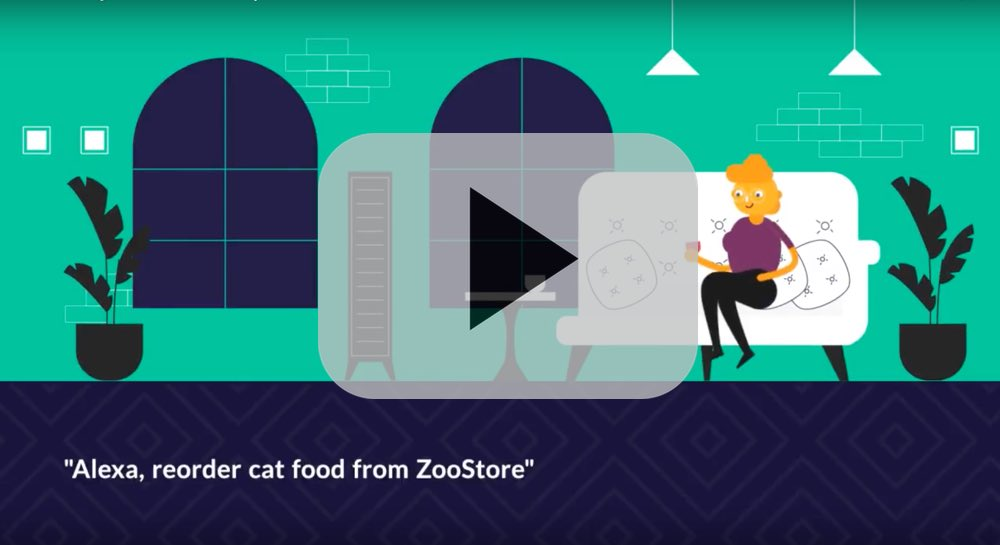

VoiceCommerce is a library that makes it to connect ecommerce stores with
voice user interfaces, especially Amazon Alexa and Google Assistant.

Currently it works with any [Vue Storefront](https://vuestorefront.io)-based
store, allowing developers to quickly build voice integrations that provide
common ecommerce features.

[](https://www.youtube.com/watch?v=6yxeykq3XGs)

## Installing VoiceCommerce

To install the library in your local node environment, run:

`npm install --save voicecommerce`

Then, in your project code include the following, to easily connect to
VueStorefront store.

```javascript
const {VueStorefrontApi, Authentication, inMemoryAuthenticationPersistence} = require('voicecommerce')

const api = new VueStorefrontApi({ endpoint: 'https://demo.vuestorefront.io' })
const authentication = new Authentication(inMemoryAuthenticationPersistence);
```

## Building your first Alexa Skill for ecommerce

The easiest way to start building voice apps is with [Jovo framework](https://www.jovo.tech).
VoiceCommerce seamlessly connects with it, giving you a chance to quickly
build a working voice app for ecommerce.

### Boostraping a project

To bootstrap a project, follow this guide: [Bootstraping project with Jovo](https://www.jovo.tech/blog/project-1-hello-world/)

Once you get the hello world working, you're ready to add ecommerce features.

### Adding OAuth

First, you'll need to set up account linking in your Alexa Skill.
For more details, read [how to configure account linking](docs/AlexaAccountLinking.md)

In the index.js file of your jovo project add OAuth handler:
```javascript
  ...
  const oauthConfig = {
    clients: [
      {
        clientId: 'XXXXXX',
        clientSecret: 'XXXXXX',
        redirectUris: ['http://XXXXX']
      }
    ]
  }

  Webhook.use('/oauth', authentication.oauthHandler(api, oauthConfig))

  // generated by jovo
  Webhook.post('/webhook', (req, res) => {
      app.handleWebhook(req, res)
  });
  ...
```

### Reordering action

Then, in the app/app.js file add the following to one of the intents:
```javascript
  const { Reorder } = require('voicecommerce')

  'HelloWorldIntent': function() {
    authentication.getUser(this.getAccessToken()).then((user) => {
      if (!user) {
        this.alexaSkill().showAccountLinkingCard()
        this.tell('Please link your account before making purchases')
        return;
      }

      const reorder = new Reorder(api)
      reorder.call(user).then(() => {
        this.tell('Ordering the same products as usual')
      })
    })
  },
```

That's it!

## Configuration

- [Implementing persistence](docs/Persistence.md)
- [Custom login screen](docs/LoginScreen.md)

## Roadmap

The major features that are coming up include:

- Amazon Pay support
- Google Pay support
- More predefined actions (checking order status etc.)

## Contributing

We're always open for contributions. If you'd like to get involved, contact us
at [rafal@upsidelab.io](mailto:rafal@upsidelab.io).

If you've found any bugs or have ideas for new features you can create an issue
on GitHub.

## License

VoiceCommerce is provided under the MIT license.

Please see [LICENSE](/LICENSE) for licensing details.
