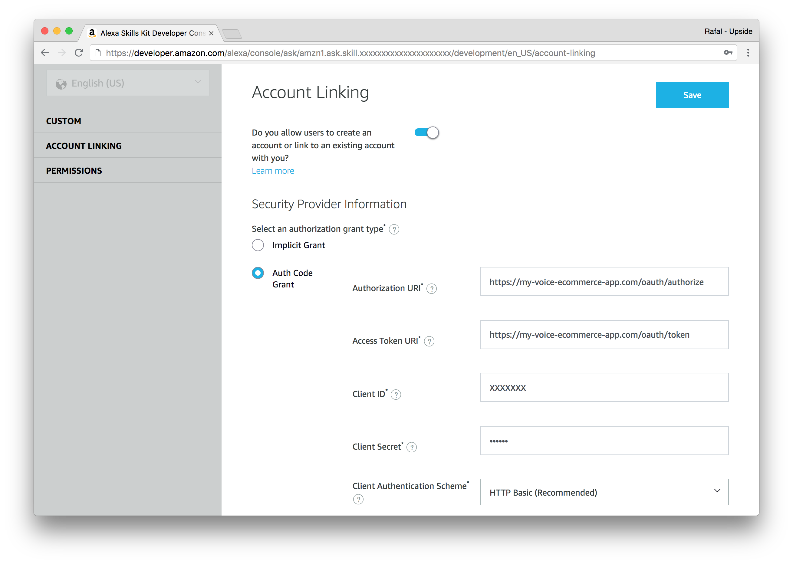

# Configuring Alexa Account Linking

When building voice integrations for ecommerce, you'll most likely need to
allow the user to sign in to the store.
This is done via "account linking" feature (available both in Alexa and
Google Assistant).

To get started with Alexa, go to
[Alexa Skills Kit Console](https://developer.amazon.com) and in the "Build"
section, navigate to "Account Linking" configuration panel.

Then, do the following:
1. Enable account linking using the toggle at the top
2. Select "Auth Code Grant" as authorization grant type
3. Set `https://YOUR_VOICE_APP_ENDPOINT/oauth/authorize` as Authorization URI
4. Set `https://YOUR_VOICE_APP_ENDPOINT/oauth/token` as Access Token URI
5. [Generate Client ID and Client Secret](https://www.oauth.com/oauth2-servers/client-registration/client-id-secret/) and set them in appropriate fields
6. Keep Client Authorization Scheme set to HTTP Basic
7. Click "Save" at the top
